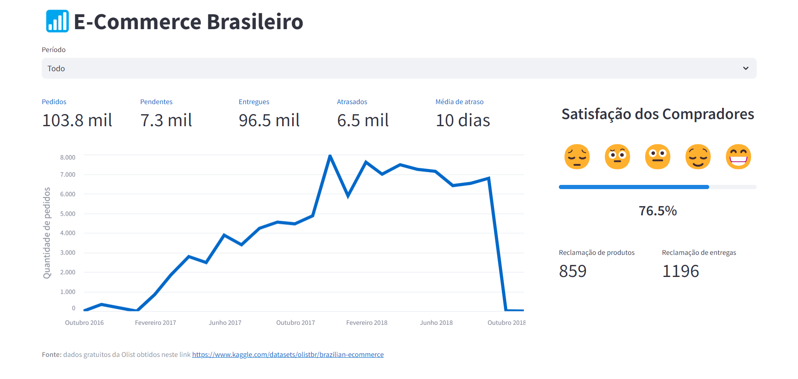
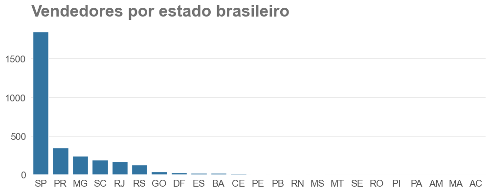
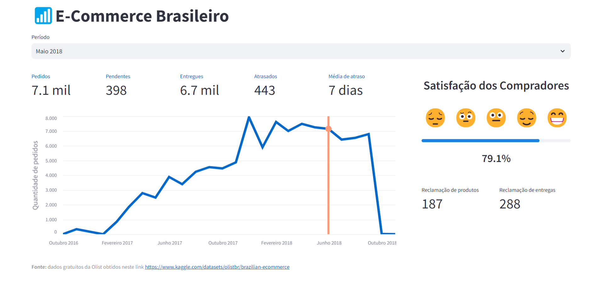

# Análise de Dados: E-Commerce Brasileiro



Utilizando dados forncercidos gratuitamente pela Olist, o objetivo deste projeto foi produzir um dashboard que permita analisar informações cruciais de vendas e avaliações dos clientes. No dashboard final podemos encontrar informações como:

* Volume de pedidos no decorrer do tempo.

* Detalhes de entrega.

* Grau de satisfação dos clientes.

* Indicadores de problemas relacionados a produtos e entregas.

Com essas informações, pretende-se identificar tendências de vendas em diferentes períodos do ano e/ou detectar automaticamente problemas relacionados a produtos e entregas. Ainda, espera-se uma melhor tomada de decisões estratégicas para solucionar desafios e fornecer insights relacionados ao e-commerce brasileiro.

## Dados

Este projeto se baseia nos dados forncidos gratuitamente pela empresa Olist diretamente na plataforma Kaggle neste link: <https://www.kaggle.com/datasets/olistbr/brazilian-ecommerce>

## Principais Insights

* O estado brasileiro com maior número de vendedores é São Paulo, como é possível observar na imagem abaixo:



* Analisando a média de atraso dos pedidos, consegui constatar que **1 a cada 14 pedidos atrasam**.

* Por meio de processamento de linguagem natural, **é possível detectar** se uma review de cliente contém alguma **reclamação sobre o produto vendido ou entrega**.

## Demonstração do dashboard



A utilização do dashboard é bem simples. Basicamente, na parte superior há a opção para selecionar o período em que se deseja observar. Além de datas específicas, é possível analisar todo o conjunto ao slecionar a opção "Todo" em "Período".

## Rode na sua máquina

Para reproduzir este projeto em sua máquina rode os comandos na sequência:

```text
1. git clone https://github.com/joaomr7/OlistAnaliseComercioBR.git

2. pip install -r requirements.txt

3. (opcional) python main.py

4. python -m streamlit run app.py
```

**Nota:** é recomendável criar um ambiente python separado para este projeto.
